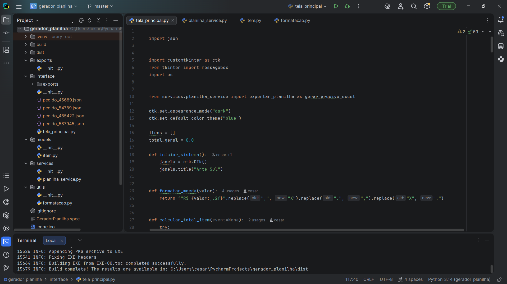
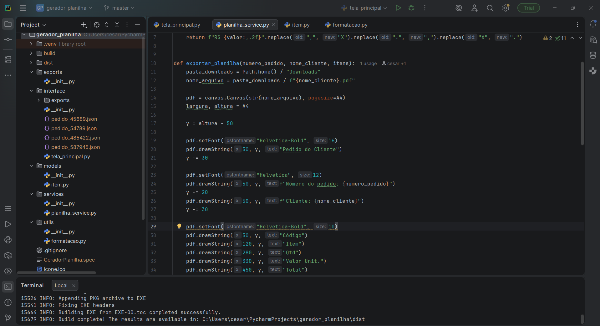
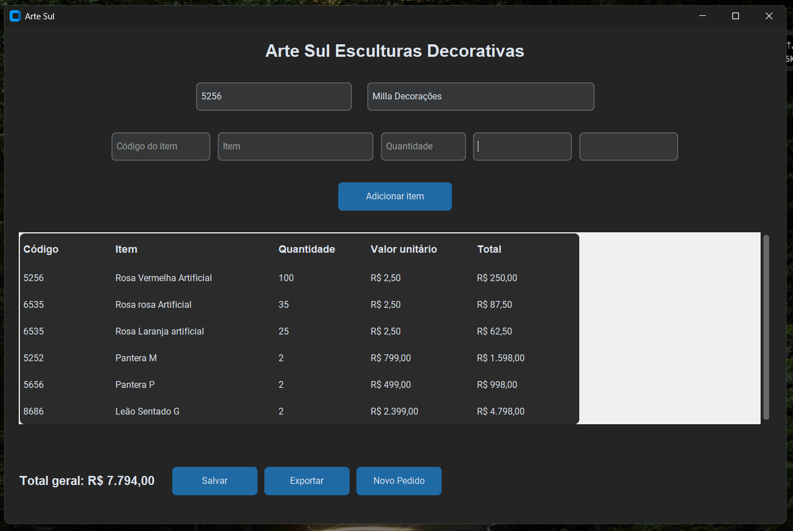
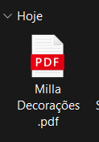
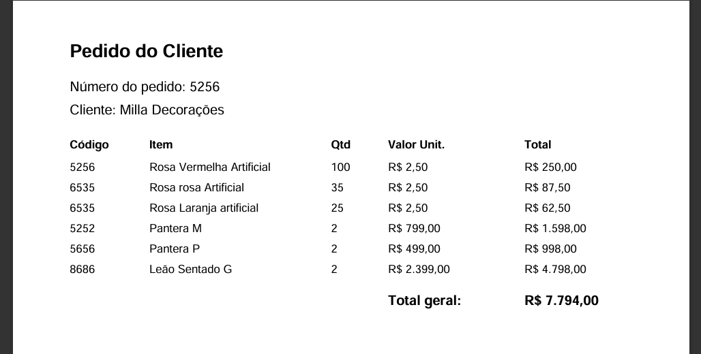
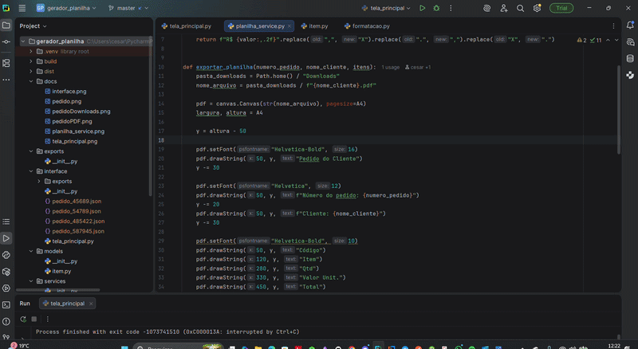

# 📊 Gerador de Planilhas de Pedidos em Python

## 🚀 Sobre o Projeto

Este projeto foi desenvolvido com o objetivo de automatizar a geração de planilhas de pedidos, facilitando o processo operacional no ambiente de trabalho.

A aplicação permite a entrada de dados de forma simples através de uma interface gráfica e gera automaticamente uma planilha Excel padronizada, reduzindo erros manuais e aumentando a produtividade.

## 🎯 Objetivo

Resolver um problema real do dia a dia: a criação manual de pedidos, que demandava tempo e estava sujeita a falhas.

Com essa solução, o processo se tornou:

* Mais rápido ⚡
* Mais organizado 📂
* Mais confiável ✅

## 💻 Tecnologias Utilizadas

* Python
* Tkinter (interface gráfica)
* Manipulação de arquivos Excel

## 🖥️ Funcionalidades

* Interface gráfica simples e intuitiva
* Entrada de dados para geração de pedidos
* Criação automática de planilhas Excel
* Padronização das informações
* Redução de tarefas repetitivas

## 📸 Demonstração

Adicione aqui prints da aplicação ou GIF mostrando o funcionamento.

## 📸 Demonstração do Sistema

### 🖥️ Tela Principal


### ⚙️ Serviço de Planilha


### 🧾 Interface do Sistema


### 📦 Geração de Pedido


### 📥 Download do Pedido


### 📄 Pedido em PDF


## 🎥 Demonstração

<p align="center">
  
</p>


## ▶️ Como Executar o Projeto

### Pré-requisitos:

* Python instalado (versão 3.x)

### Passos:

```bash
# Clone o repositório
git clone https://github.com/Cesarleitor/gerador_Planilha_Excel.git

# Acesse a pasta do projeto
cd gerador_Planilha_Excel

# (Opcional) Criar ambiente virtual
python -m venv .venv

# Ativar ambiente virtual (Windows)
.venv\Scripts\activate

# Instalar dependências (se houver)
pip install -r requirements.txt

# Executar o projeto
python interface/tela_principal.py
```

## 📈 Impacto no Uso Real

Este sistema já está sendo utilizado no ambiente de trabalho, trazendo benefícios como:

* Redução de tempo na geração de pedidos
* Diminuição de erros manuais
* Melhor organização das informações

## 🔄 Melhorias Futuras

* Validação de dados mais robusta
* Melhorias na interface do usuário
* Integração com banco de dados
* Geração de relatórios
* Evolução para versão web

## 🤝 Contribuição

Sinta-se à vontade para contribuir com melhorias, sugestões ou abrir issues.

## 📌 Autor

Desenvolvido por Cesar
